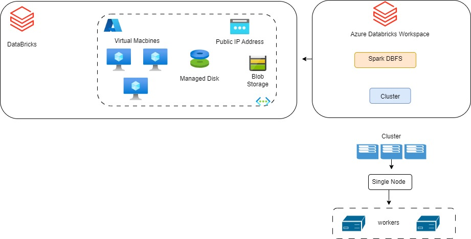

# Databrikcs_CLuster_Spark
## InfraEstrutura com Databriks Workspace e um Cluster Spark.

Este projeto cria uma infraestrutura de Databricks Workspace e Cluster Spark no Azure utilizando Terraform.

Essa Infra é composta:

1 Databricks Workspace:  Ambiente colaborativo onde os usuários podem criar, gerenciar e compartilhar notebooks, dashboards, bibliotecas e outros recursos relacionados à análise de dados.
1 Cluster Spark composto 1 Node e 2 Workers (AUTOSCALE): Recurso para processamento distribuido

# Recomendações
Desligar clusters quando não estão em uso é uma prática recomendada para evitar custos desnecessários, especialmente em ambientes de nuvem, onde os clusters são cobrados com base no tempo de execução.
# autotermination_minutes = 10 

Um All Purpose é uma opção para reduzir custos e simplificar o gerenciamento de recursos, especialmente em ambientes onde múltiplos usuários ou equipes precisam acessar o mesmo cluster.
# node_type_id = "Standard_DS3_v2"

